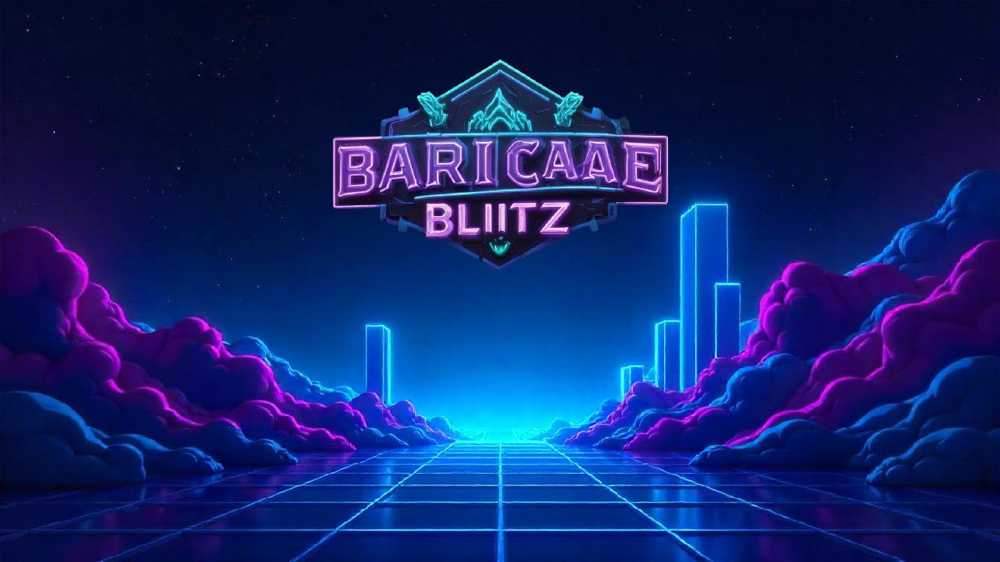
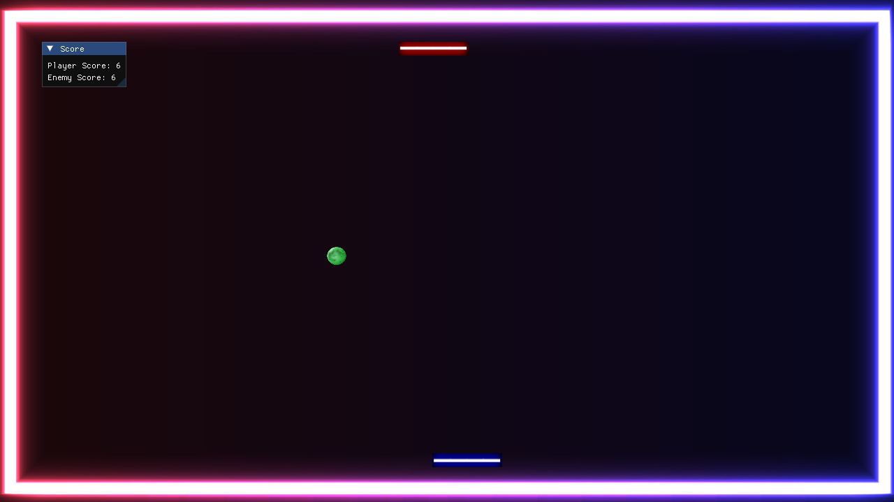

# Barricade Blitz

Barricade Blitz is a game project that uses SDL2 for rendering and handling events. This project includes a Makefile to compile and link the code.



## Prerequisites

Before you can compile and run the project, you need to have the following installed on your system:

- g++ (GNU C++ compiler)
- SDL2
- SDL2_image
- SDL2_mixer
- asio (for networking)

On Debian-based systems, you can install these dependencies using the following commands:

```sh
sudo apt-get update
sudo apt-get install g++ libsdl2-dev libsdl2-image-dev libsdl2-mixer-dev libasio-dev
```
### Fedora

On Fedora, you can install these dependencies using the following commands:

```sh
sudo dnf update
sudo dnf install g++ SDL2-devel SDL2_image-devel SDL2_mixer-devel asio-devel
```

# ImGui Shared Library

This project builds and installs the ImGui shared library using CMake. ImGui is a bloat-free graphical user interface library for C++.

## Prerequisites

Before you begin, ensure you have the following installed on your system:

- CMake (version 3.10 or higher)
- SDL2 development libraries

## Building the ImGui Shared Library

Follow these steps to build the ImGui shared library:

1. **Enter the project directory:**

   ```sh
   cd imgui-static
   ```

2. **Create a build directory:**

   ```sh
   mkdir build
   cd build
   ```

3. **Run CMake to configure the project:**

   ```sh
   cmake ..
   ```

4. **Build the project:**

   ```sh
   make
   ```

## Installing the ImGui Shared Library

To install the ImGui shared library system-wide, run the following command from the `build` directory:

```sh
sudo make install
```

This will install the shared library to the appropriate system directories:

- The library will be installed to `/usr/local/lib` (or equivalent on your system).
- The header files will be installed to `/usr/local/include/imgui` (or equivalent on your system).

## Uninstalling the ImGui Shared Library

To uninstall the ImGui shared library, run the following command from the `build` directory:

```sh
sudo make uninstall
```

This will remove the installed library and header files from the system directories.

## Building the Project

To compile the project, follow these steps:

1. Clone the repository:
    ```sh
    git clone https://github.com/theweird-kid/barricade-blitz.git
    cd barricade-blitz
    ```

2. Build the project using the provided Makefile:
    ```sh
    make
    ```

This will create the `bin` directory and compile the source files into an executable named `main` inside the `bin` directory.

## Running the Project

After successfully building the project, you can run the executable:

```sh
./bin/main
```
## Game Controls

- **G**: Start the game
- **R**: Reset the game
- **M**: Play/Stop music
- **Left Arrow Key**: Move the player to the left
- **Right Arrow Key**: Move the player to the right

## Cleaning Up

To clean up the compiled files, you can use the `clean` target in the Makefile:

```sh
make clean
```

This will remove the `main` executable from the `bin` directory.
